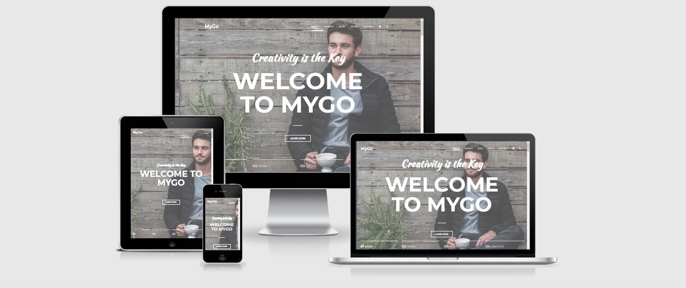

# MyGo - Milestone Project 2 

You can view my site [Link the live project here](https://ekadiev.github.io/mygo-ms2/index.html) 

## Project Overview

This website was created for the main purpose to completing the Milestone Project Two as a part of the Code Institute's Full Stack Developer course, 
and using knowledge of HTML5, CSS3 and JavaScript. My idea of this project is build a website to promote myself as a Wed Developer. 
I've specialise in Web Design, SEO and web solutions. Project was designed to be responsibe and accessible on a range of devices, such as 
desktop, laptop, and other mobile devices, and making it easy to navigate for potential clients.